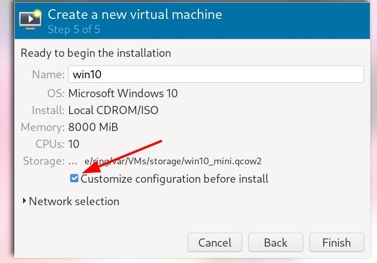
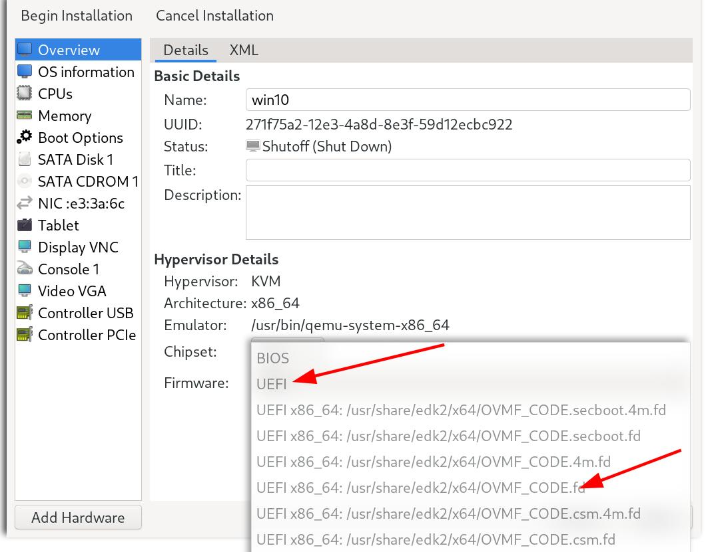
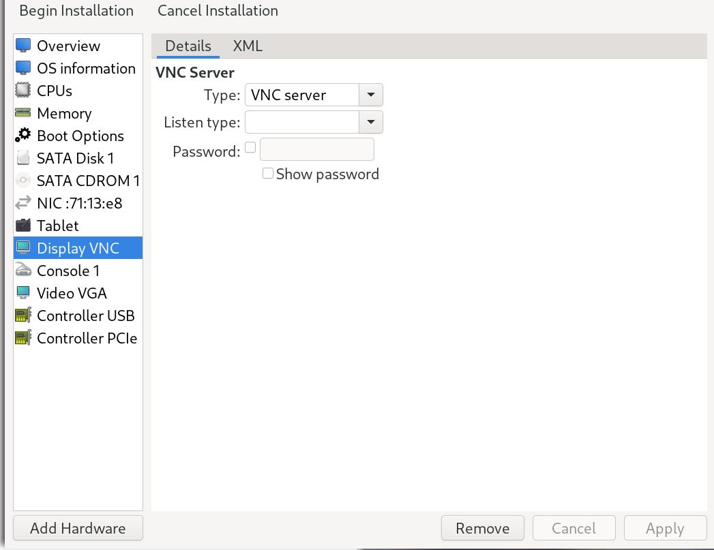

# 单显卡直通

> 总结只要能用vfio把显卡隔离出来就算成功了, 剩下都是调试问题

## 单显卡直通

### 安装一个启用UEFI的windows虚拟机

1. 在安装准备时勾选"安装前手动配置", (Customize configuration before install)



1. 在Overview栏, Firmware(固件)项中选择UEFI, 没有UEFI选项的arch用户可以安装ovmf包后再尝试




#### 启动vnc功能

virt-manager安装的虚拟机默认会启动vnc, 不需要多于操作。后面我们会用另一台电脑通过vnc




#### (可选)安装virtio驱动

- 下载virtio-win的驱动
    * [官方仓库](https://github.com/virtio-win/virtio-win-pkg-scripts/blob/master/README.md)
    * [下载链接](https://fedorapeople.org/groups/virt/virtio-win/direct-downloads/stable-virtio/virtio-win.iso)
- 添加storage存储设备, virtio驱动作为CDROM, 后续会用于安装virtio驱动


### 启动宿主机的iommu功能

grub用户可以通过修改grub配置文件(`/etc/default/grub`)添加内核命令行参数, 其他bootloader用户可以搜添加内核命令行参数的方法。

- 修改`/etc/default/grub`配置文件, 在`GRUB_CMDLINE_LINUX_DEFAULT`添加参数启用iommu, `intel_iommu=on iommu=pt`, amd的CPU就用`amd_iommu=on`

```
$ vim /etc/default/grub

GRUB_CMDLINE_LINUX_DEFAULT="loglevel=3 quiet intel_iommu=on iommu=pt"
```

- 使用`grub-mkconfig`应用修改

```
$ grub-mkconfig -o /boot/grub/grub.cfg
```

重启后生效

使用如下脚本获取IOMMU分组信息:

```bash
#!/bin/bash
shopt -s nullglob
for g in /sys/kernel/iommu_groups/*; do
    echo "IOMMU Group ${g##*/}:"
    for d in $g/devices/*; do
        echo -e "\t$(lspci -nns ${d##*/})"
    done;
done;
```

记录显卡相关设备的id, 如我这里的分别是`10de:2482`和`10de:228b`。(不过我们但显卡直通用不到`:)`)


### 不需要配置vfio内核模块

archwiki中vfio的相关操作是双显卡直通的操作, 所以需要配置vfio以在GPU被使用前将GPU隔离出来。但我们单显卡直通的思路是关掉所有图像界面, 卸载NVIDIA驱动, 手动使用vfio驱动, 所以我们不需要对vfio做其他配置。

### 配置virt manager钩子脚本

每个虚拟机的启动和关闭都会调用一个hook脚本(如果脚本存在的话), 根据[官方文档](https://libvirt.org/hooks.html#etc-libvirt-hooks-qemu)的描述, qemu虚拟机在启动和关闭时都会调用`/etc/libvirt/hooks/qemu`这个脚本, 所以我们编写以下hook脚本：

1. 启动虚拟机时关闭所有图形界面(关闭所有使用NVIDIA驱动的程序), 换上vfio驱动做设备隔离
    - 而要关掉nvidia驱动则需要关闭所有正在使用的程序, 如窗口管理器, 桌面管理器等
2. 关闭虚拟机时再将NVIDIA驱动恢复, vfio可以选择不卸载(这里测试不卸载vfio驱动也没有影响)

```bash
# qemu

OBJECT="$1"
OPERATION="$2"

if [[ $OBJECT == "win10" ]]; then
	case "$OPERATION" in
        	"prepare")
                systemctl start libvirt-nosleep@"$OBJECT"  2>&1 | tee -a /var/log/libvirt/custom_hooks.log
                /bin/vfio-startup.sh 2>&1 | tee -a /var/log/libvirt/custom_hooks.log
                ;;

            "release")
                systemctl stop libvirt-nosleep@"$OBJECT"  2>&1 | tee -a /var/log/libvirt/custom_hooks.log  
                /bin/vfio-teardown.sh 2>&1 | tee -a /var/log/libvirt/custom_hooks.log
                ;;
	esac
fi
```

启动前触发的命令:

```bash
/etc/libvirt/hooks/qemu guest_name prepare begin -
```

关闭后触发的命令:

```bash
/etc/libvirt/hooks/qemu guest_name release end -
```

#### 配置防止休眠

添加一个systemd的守护进程, 创建文件`/etc/systemd/system/libvirt-nosleep@.service`, 在其中添加以下内容:

```
[Unit]
Description=Preventing sleep while libvirt domain "%i" is running

[Service]
Type=simple
ExecStart=/usr/bin/systemd-inhibit --what=sleep --why="Libvirt domain \"%i\" is running" --who=%U --mode=block sleep infinity
```

#### 配置启动(前)脚本

可以将本仓库的这个脚本软连接到`/bin`目录下, 因为`/etc/libvirt/hooks/qemu`里调用的是`/bin`目录下的脚本

```bash
ln -s /path/to/repo/vfio-startup.sh /bin/
```

启动钩子如下: 注释掉的部分时调试的结果, 后面会说如何调试

```bash
set -x

# 关闭所有使用GPU的程序, 如果使用里dm如sddm直接systemctl stop your_dm.service即可
# 如果像我一样没使用任何dm直接通过startx启动窗口管理器的, 直接killall your_wm即可
# 实际还有哪些程序占用GPU可以通过lsmod | grep nvidia查看
# systemctl stop lxdm.service
# killall lxdm-session
# killall bspwm

# 休眠一段时间方式数据竞争
sleep 4

# 卸载nvidia驱动
modprobe -r nvidia_drm
modprobe -r nvidia_uvm
modprobe -r nvidia_modeset
modprobe -r nvidia

# 关闭console, 这里测试其实可以不关, anyway大家都关我也关
echo 0 > /sys/class/vtconsole/vtcon0/bind
echo 0 > /sys/class/vtconsole/vtcon1/bind

# 部分显卡没有framebuffer所以会说无法写入, 直接注释掉即可
#echo efi-framebuffer.0 > /sys/bus/platform/drivers/efi-framebuffer/unbind

# 休眠一段时间方式数据竞争
sleep 2

# 使用libvirt相关的工具detach GPU设备
# 可以通过lspci查看显卡的总线id, 如我的是
# 01:00.0 VGA compatible controller: NVIDIA Corporation GA104 [GeForce RTX 3070 Ti] (rev a1)
# 01:00.1 Audio device: NVIDIA Corporation GA104 High Definition Audio Controller (rev a1)
# 所以01_00_0对应的就是01:00.0, 01_00_1对应的就是01:00.1
virsh nodedev-detach pci_0000_01_00_0
virsh nodedev-detach pci_0000_01_00_1

# 换上vfio驱动, 这里测试启用vfio-pci就够了
modprobe vfio-pci
# modprobe vfio
# modprobe vfio_iommu_type1
```


#### 配置关闭(后)脚本

可以将本仓库的这个脚本软连接到`/bin`目录下, 因为`/etc/libvirt/hooks/qemu`里调用的是`/bin`目录下的脚本

```bash
ln -s /path/to/repo/vfio-teardown.sh /bin/
```

关闭钩子如下: 注释掉的部分时调试的结果, 后面会说如何调试

```bash
set -x

# 换下vfio驱动, 这测试时可以不用关的
# modprobe -r vfio_pci
# modprobe -r vfio
# modprobe -r vfio_iommu_type1

# 使用libvirt相关的工具重新attach GPU设备
# 可以通过lspci查看显卡的总线id, 如我的是
# 01:00.0 VGA compatible controller: NVIDIA Corporation GA104 [GeForce RTX 3070 Ti] (rev a1)
# 01:00.1 Audio device: NVIDIA Corporation GA104 High Definition Audio Controller (rev a1)
# 所以01_00_0对应的就是01:00.0, 01_00_1对应的就是01:00.1
virsh nodedev-reattach pci_0000_01_00_0
virsh nodedev-reattach pci_0000_01_00_1

# 重新挂在nvidia驱动
modprobe nvidia
modprobe nvidia_modeset
modprobe nvidia_uvm
modprobe nvidia_drm

# 重新开启console, 我这里尝试重新开启vtcon1后就会死机, 调试发现是开始vfio后导致的,所以就不开了
echo 1 > /sys/class/vtconsole/vtcon0/bind
#echo 1 > /sys/class/vtconsole/vtcon1/bind

#echo efi-framebuffer.0 > /sys/bus/platform/drivers/efi-framebuffer/bind

# 重启你的图形化程序, 窗口管理器, 桌面管理器等
# systemctl start lxdm.service
```

### ⭐调试⭐

最重要的是懂得怎么调试, 我们需要额外一台可以通过ssh连接到这里的设备(手机, 平板等)。


- 查询需要现在直通的主机的ip, archlinux使用`ip addr`
- 然后使用ssh命令连接到主机

```
$ ssh username@remote_host -p 22
```

直接运行`/bin/vfio-startup.sh`和`/bin/vfio-teardown.sh`查看报错信息, 或者逐行测试。这里总结了几种错误

- 内核模块无法卸载
- `virsh nodedev-detach`卡死
- vfio没有启用
- `/bin/vfio-teardown.sh`恢复后无响应

#### 逐行调试

##### 卸载module

直接运行如下命令会发现提示被占用, 这时需要先关闭所有的图形程序。

```
modprobe -r nvidia_drm
modprobe -r nvidia_uvm
modprobe -r nvidia_modeset
modprobe -r nvidia
```

使用lsmod查看被几个程序占用, 这里关掉我的窗口管理器bspwm后就没有占用了, `killall bspwm`

```
[ring@archlinux ~]%  killall bspwm
[ring@archlinux ~]%  lsmod | grep nvidia
nvidia_drm             94208  0
nvidia_uvm           3477504  0
nvidia_modeset       1556480  1 nvidia_drm
nvidia              62713856  2 nvidia_uvm,nvidia_modeset
video                  77824  1 nvidia_modeset
```

之后在逐个model卸载

```
modprobe -r nvidia_drm
modprobe -r nvidia_uvm
modprobe -r nvidia_modeset
modprobe -r nvidia
```

##### vtcon unbind

> 测试unbind(写入0)再重新bind(写入1)的情况

接着测试`vfio-startup.sh`里的命令。经过上一步关闭图形程序和卸载nvidia驱动, 你已经关闭了所有图形程序, 你面前只有一个命令行:


运行下面的命令后会发现你的光标不再跳动, 对应`vfio-startup.sh`

```
echo 0 > /sys/class/vtconsole/vtcon0/bind
echo 0 > /sys/class/vtconsole/vtcon1/bind
```

运行下面的命令后会发现你的光标恢复跳动, 对应`vfio-teardown.sh`

```
echo 1 > /sys/class/vtconsole/vtcon0/bind
echo 1 > /sys/class/vtconsole/vtcon1/bind
```

##### nodedev-detach

```
virsh nodedev-detach pci_0000_01_00_0
virsh nodedev-detach pci_0000_01_00_1
```

这里的`pci_0000_A_B_C`中的A, B, C是通过lspci命令查看的, 如我lspci后看到GPU设备对应的总线id如下

```
$ lspci | grep NVID
01:00.0 VGA compatible controller: NVIDIA Corporation GA104 [GeForce RTX 3070 Ti] (rev a1)
01:00.1 Audio device: NVIDIA Corporation GA104 High Definition Audio Controller (rev a1)
```

所以`pci_0000_01_00_0`对应的就是01:00.0, `pci_0000_01_00_0`对应的就是01:00.1

如果这时你没有卸载nvidia驱动会发现执行`virsh nodedev-detach`无法完成执行, 因为设备被占用了


##### 启用vfio

这时你卸载了nvidia驱动, unbind了console, detach了GPU。从console中看都光标不再跳动，但再ssh中仍然可以操作。

继续执行`vfio-startup.sh`中的命令:

```
modprobe vfio-pci
```

再ssh中通过`lspci -v | less`搜索NVIDIA可以看到这时GPU使用的是vfio驱动了, 说明设备隔离成功！


##### vfio teardown恢复原本状态

> 整个过程再ssh中测试, 因为主机的界面已经不更新了

`vfio-startup.sh`执行完成后再测试`vfio-teardown.sh`恢复，基本就是`vfio-startup.sh`的一个逆过程。

卸载vfio模块, 不过我这里测试不卸载也没事, nvidia驱动也能挂载

```
# modprobe -r vfio_pci
# modprobe -r vfio
# modprobe -r vfio_iommu_type1
```

virsh reattach GPU设备

```
virsh nodedev-reattach pci_0000_01_00_0
virsh nodedev-reattach pci_0000_01_00_1
```

重新挂载nvidia显卡驱动

```
modprobe nvidia
modprobe nvidia_modeset
modprobe nvidia_uvm
modprobe nvidia_drm
```

`lspci -v`查看驱动使用情况, nvidia自动又使用上了


重新启用vconsole, 原本我们写入0关闭了两个vtcon, 现在想要写入1重启。但我在写入1重启vtcon1使就会出现coredump, 所有我不写了, 使用下来也没有问题。

```
echo 1 > /sys/class/vtconsole/vtcon0/bind
#echo 1 > /sys/class/vtconsole/vtcon1/bind
```


##### vfio-teardown执行完毕

至此, 把vfio-startup和vfio-teardown的命令都执行了一遍，按理说原本状态应该恢复了。但是你可能会发现你主机上的光标还是没有跳动。不要慌，这时你的主机其实已经可以接收命令了，**盲打图形界面启动命令, 或者在teardown后自动启动图形界面即可**。因为我这时没有使用任何dm, 直接通过startx启动的窗口管理器, 所以我盲打startx来启动我的窗口管理器。

### 启动虚拟机

#### 配置usb设备直通

#### 安装显卡驱动

1. 你可以等windows自动检测然后安装NVIDIA的驱动
2. 你可以可以通过vnc连接到主机然后手动安装

